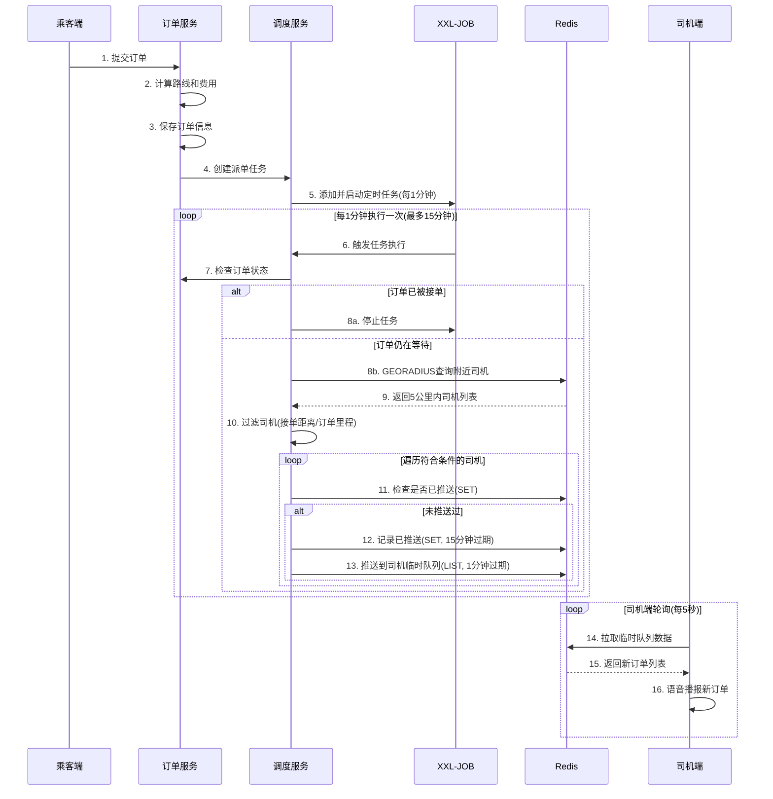
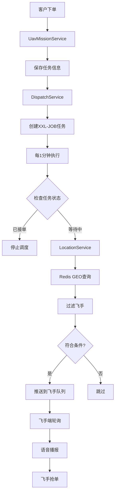

# 代驾项目派单机制分析与无人机项目迁移方案

## 一、代驾项目派单机制深度分析

### 1.1 核心技术栈

#### 1.1.1 Redis GEO
- **用途**：存储司机实时位置信息
- **关键命令**：
  - `GEOADD`：添加司机位置到GEO集合
  - `GEORADIUS`：查询指定坐标半径范围内的司机
- **优势**：内存计算，比MySQL GEO快上千倍

#### 1.1.2 XXL-JOB 分布式任务调度
- **版本**：2.4.1-SNAPSHOT
- **架构**：
  - 调度中心（xxl-job-admin）：管理和触发任务
  - 执行器（service-dispatch）：执行具体业务逻辑
- **特性**：
  - 支持CRON表达式
  - 支持集群部署
  - 支持动态添加/启动/停止任务
  - 支持任务失败重试

### 1.2 派单流程详解



### 1.3 关键数据结构

#### 1.3.1 Redis数据结构

```java
// 1. 司机位置GEO集合
Key: "driver:geo:location"
Type: GEO
Value: Point(longitude, latitude) -> driverId

// 2. 订单已推送司机记录
Key: "driver:order:repeat:list:{orderId}"
Type: SET
Value: Set<driverId>
Expire: 15分钟

// 3. 司机临时订单队列
Key: "driver:order:temp:list:{driverId}"
Type: LIST
Value: List<NewOrderDataVo(JSON)>
Expire: 1分钟
```

#### 1.3.2 数据库表结构

```sql
-- 订单任务关联表
CREATE TABLE order_job (
    id BIGINT PRIMARY KEY,
    order_id BIGINT NOT NULL COMMENT '订单ID',
    job_id BIGINT NOT NULL COMMENT 'XXL-JOB任务ID',
    parameter TEXT COMMENT '任务参数(JSON)',
    create_time DATETIME,
    update_time DATETIME
);

-- XXL-JOB日志表
CREATE TABLE xxl_job_log (
    id BIGINT PRIMARY KEY,
    job_id BIGINT NOT NULL COMMENT '任务ID',
    status TINYINT COMMENT '状态:0失败,1成功',
    times INT COMMENT '耗时(毫秒)',
    error TEXT COMMENT '错误信息',
    create_time DATETIME
);

-- 司机设置表
CREATE TABLE driver_set (
    id BIGINT PRIMARY KEY,
    driver_id BIGINT NOT NULL,
    service_status TINYINT COMMENT '服务状态:0关闭,1开启',
    order_distance DECIMAL(10,2) COMMENT '订单里程限制(0不限制)',
    accept_distance DECIMAL(10,2) COMMENT '接单距离限制(公里)',
    is_auto_accept TINYINT COMMENT '是否自动接单:0否,1是'
);
```

### 1.4 核心业务逻辑

#### 1.4.1 司机位置更新
```java
// 司机开启接单服务后，实时上传位置
public Boolean updateDriverLocation(UpdateDriverLocationForm form) {
    // 1. 检查司机是否开启接单服务
    DriverSet driverSet = getDriverSet(form.getDriverId());
    if(driverSet.getServiceStatus() != 1) {
        throw new GuiguException("未开启接单服务");
    }
    
    // 2. 更新Redis GEO
    Point point = new Point(form.getLongitude(), form.getLatitude());
    redisTemplate.opsForGeo().add("driver:geo:location", point, form.getDriverId());
    return true;
}
```

#### 1.4.2 搜索附近司机
```java
public List<NearByDriverVo> searchNearByDriver(SearchNearByDriverForm form) {
    // 1. 定义搜索范围(5公里)
    Point point = new Point(form.getLongitude(), form.getLatitude());
    Distance distance = new Distance(5, DistanceUnit.KILOMETERS);
    Circle circle = new Circle(point, distance);
    
    // 2. 执行GEO搜索
    GeoResults<GeoLocation<String>> results = 
        redisTemplate.opsForGeo().radius("driver:geo:location", circle, args);
    
    // 3. 过滤司机
    List<NearByDriverVo> list = new ArrayList<>();
    for(GeoResult<GeoLocation<String>> item : results.getContent()) {
        Long driverId = Long.parseLong(item.getContent().getName());
        BigDecimal currentDistance = new BigDecimal(item.getDistance().getValue());
        
        // 获取司机设置
        DriverSet driverSet = getDriverSet(driverId);
        
        // 接单距离判断
        if(driverSet.getAcceptDistance() != 0 && 
           driverSet.getAcceptDistance().compareTo(currentDistance) < 0) {
            continue;
        }
        
        // 订单里程判断
        if(driverSet.getOrderDistance() != 0 && 
           driverSet.getOrderDistance().compareTo(form.getMileageDistance()) < 0) {
            continue;
        }
        
        list.add(new NearByDriverVo(driverId, currentDistance));
    }
    return list;
}
```

#### 1.4.3 任务调度执行
```java
@XxlJob("newOrderTaskHandler")
public void newOrderTaskHandler() {
    Long jobId = XxlJobHelper.getJobId();
    
    // 1. 获取任务参数
    OrderJob orderJob = getOrderJobByJobId(jobId);
    NewOrderTaskVo taskVo = JSON.parseObject(orderJob.getParameter());
    
    // 2. 检查订单状态
    Integer orderStatus = getOrderStatus(taskVo.getOrderId());
    if(orderStatus != OrderStatus.WAITING_ACCEPT) {
        xxlJobClient.stopJob(jobId); // 停止任务
        return;
    }
    
    // 3. 搜索附近司机
    List<NearByDriverVo> drivers = searchNearByDriver(taskVo);
    
    // 4. 推送订单给司机
    for(NearByDriverVo driver : drivers) {
        String repeatKey = "driver:order:repeat:list:" + taskVo.getOrderId();
        
        // 检查是否已推送
        if(!redisTemplate.opsForSet().isMember(repeatKey, driver.getDriverId())) {
            // 记录已推送
            redisTemplate.opsForSet().add(repeatKey, driver.getDriverId());
            redisTemplate.expire(repeatKey, 15, TimeUnit.MINUTES);
            
            // 推送到司机临时队列
            String queueKey = "driver:order:temp:list:" + driver.getDriverId();
            redisTemplate.opsForList().leftPush(queueKey, JSON.toJSONString(newOrderData));
            redisTemplate.expire(queueKey, 1, TimeUnit.MINUTES);
        }
    }
}
```

### 1.5 关键配置参数

| 参数 | 值 | 说明 |
|------|-----|------|
| 搜索半径 | 5公里 | Redis GEO搜索范围 |
| 任务执行频率 | 每1分钟 | CRON: `0 0/1 * * * ?` |
| 订单等待时间 | 15分钟 | 超时自动取消 |
| 司机队列过期 | 1分钟 | 临时队列TTL |
| 重复推送记录 | 15分钟 | SET过期时间 |
| 司机轮询频率 | 5秒 | 前端拉取频率 |

---

## 二、无人机项目迁移方案

### 2.1 业务差异分析

| 维度 | 代驾项目 | 无人机项目 | 影响 |
|------|----------|------------|------|
| **执行主体** | 司机(人) | 飞手+无人机 | 需考虑无人机状态 |
| **位置更新** | 实时GPS | 飞手位置+无人机位置 | 双重位置管理 |
| **接单条件** | 距离+里程 | 距离+无人机续航+载重 | 更复杂的过滤条件 |
| **任务类型** | 代驾 | 航拍/配送/巡检等 | 需匹配无人机能力 |
| **安全要求** | 一般 | 高(禁飞区/天气) | 需额外安全检查 |

### 2.2 架构设计

#### 2.2.1 整体架构

```
uav-dev/
├── uav-service/              # 业务服务(已存在)
│   ├── service/
│   │   ├── dispatch/         # 新增：派单服务
│   │   │   ├── DispatchService.java
│   │   │   ├── impl/
│   │   │   │   └── DispatchServiceImpl.java
│   │   │   ├── job/          # XXL-JOB任务
│   │   │   │   └── MissionDispatchJobHandler.java
│   │   │   └── xxl/          # XXL-JOB配置
│   │   │       ├── config/
│   │   │       │   ├── XxlJobConfig.java
│   │   │       │   └── XxlJobClientConfig.java
│   │   │       └── client/
│   │   │           └── XxlJobClient.java
│   │   └── location/         # 新增：位置服务
│   │       ├── LocationService.java
│   │       └── impl/
│   │           └── LocationServiceImpl.java
│   ├── domain/
│   │   ├── MissionJob.java  # 新增：任务调度关联
│   │   └── XxlJobLog.java   # 新增：调度日志
│   └── mapper/
│       ├── MissionJobMapper.java
│       └── XxlJobLogMapper.java
└── xxl-job-admin/            # 新增：调度中心(独立部署)
```

#### 2.2.2 数据流设计



### 2.3 核心实现方案

#### 2.3.1 飞手位置管理

**需求**：
- 飞手开启接单后，实时上传位置到Redis GEO
- 支持查询附近飞手
- 关闭接单时清除位置信息

**实现**：
```java
// LocationService.java
public interface LocationService {
    // 更新飞手位置
    Boolean updatePilotLocation(UpdatePilotLocationForm form);
    
    // 删除飞手位置
    Boolean removePilotLocation(Long pilotId);
    
    // 搜索附近飞手
    List<NearByPilotVo> searchNearByPilot(SearchNearByPilotForm form);
}
```

**Redis Key设计**：
```
pilot:geo:location -> GEO集合(飞手位置)
pilot:mission:repeat:list:{missionId} -> SET(已推送飞手记录)
pilot:mission:temp:list:{pilotId} -> LIST(飞手临时任务队列)
```

#### 2.3.2 智能派单算法

**过滤条件**：
1. **基础条件**
   - 飞手已开启接单服务
   - 飞手在任务起点5公里范围内
   - 飞手设置的接单距离满足要求

2. **无人机条件**
   - 无人机电量充足(>30%)
   - 无人机状态正常(可用)
   - 无人机续航满足任务距离
   - 无人机载重满足任务要求

3. **任务匹配**
   - 飞手认证类型匹配任务类型
   - 任务里程在飞手设置范围内

**优先级排序**：
```java
// 综合评分 = 距离权重 + 评分权重 + 接单率权重
score = (1 - distance/maxDistance) * 0.4 
      + (rating/5.0) * 0.3 
      + acceptRate * 0.3
```

#### 2.3.3 XXL-JOB集成

**步骤1：添加依赖**
```xml
<dependency>
    <groupId>com.xuxueli</groupId>
    <artifactId>xxl-job-core</artifactId>
    <version>2.4.1</version>
</dependency>
```

**步骤2：配置文件**
```yaml
xxl:
  job:
    admin:
      addresses: http://localhost:8080/xxl-job-admin
    executor:
      appname: uav-dispatch-executor
      port: 9999
      logpath: /data/applogs/xxl-job/jobhandler
    client:
      jobGroupId: 1
      addAndStartUrl: ${xxl.job.admin.addresses}/jobinfo/addAndStartJob
      stopJobUrl: ${xxl.job.admin.addresses}/jobinfo/stopJob
```

**步骤3：任务处理器**
```java
@Component
public class MissionDispatchJobHandler {
    
    @XxlJob("newMissionTaskHandler")
    public void newMissionTaskHandler() {
        Long jobId = XxlJobHelper.getJobId();
        
        try {
            dispatchService.executeTask(jobId);
        } catch (Exception e) {
            log.error("任务执行失败", e);
            throw e;
        }
    }
}
```

### 2.4 数据库设计

```sql
-- 任务调度关联表
CREATE TABLE mission_job (
    id BIGINT PRIMARY KEY AUTO_INCREMENT,
    mission_id BIGINT NOT NULL COMMENT '任务ID',
    job_id BIGINT NOT NULL COMMENT 'XXL-JOB任务ID',
    parameter TEXT COMMENT '任务参数(JSON)',
    create_time DATETIME DEFAULT CURRENT_TIMESTAMP,
    update_time DATETIME DEFAULT CURRENT_TIMESTAMP ON UPDATE CURRENT_TIMESTAMP,
    UNIQUE KEY uk_mission_id (mission_id),
    KEY idx_job_id (job_id)
) COMMENT='任务调度关联表';

-- XXL-JOB日志表
CREATE TABLE xxl_job_log (
    id BIGINT PRIMARY KEY AUTO_INCREMENT,
    job_id BIGINT NOT NULL COMMENT '任务ID',
    status TINYINT COMMENT '状态:0失败,1成功',
    times INT COMMENT '耗时(毫秒)',
    error TEXT COMMENT '错误信息',
    create_time DATETIME DEFAULT CURRENT_TIMESTAMP,
    KEY idx_job_id (job_id),
    KEY idx_create_time (create_time)
) COMMENT='XXL-JOB执行日志';

-- 飞手位置历史表(可选)
CREATE TABLE pilot_location_history (
    id BIGINT PRIMARY KEY AUTO_INCREMENT,
    pilot_id BIGINT NOT NULL,
    longitude DECIMAL(10, 6) NOT NULL,
    latitude DECIMAL(10, 6) NOT NULL,
    create_time DATETIME DEFAULT CURRENT_TIMESTAMP,
    KEY idx_pilot_id (pilot_id),
    KEY idx_create_time (create_time)
) COMMENT='飞手位置历史';
```

### 2.5 接口设计

#### 2.5.1 位置服务接口

```java
// 1. 更新飞手位置
POST /api/location/updatePilotLocation
Request: {
    "pilotId": 123,
    "longitude": 116.404,
    "latitude": 39.915
}
Response: {
    "code": 200,
    "data": true
}

// 2. 搜索附近飞手
POST /api/location/searchNearByPilot
Request: {
    "longitude": 116.404,
    "latitude": 39.915,
    "mileageDistance": 10.5,
    "missionType": "AERIAL_PHOTOGRAPHY"
}
Response: {
    "code": 200,
    "data": [
        {
            "pilotId": 123,
            "distance": 2.5,
            "rating": 4.8,
            "acceptRate": 0.95
        }
    ]
}
```

#### 2.5.2 派单服务接口

```java
// 1. 创建派单任务
POST /api/dispatch/addAndStartTask
Request: {
    "missionId": 456,
    "startLocation": "北京市朝阳区",
    "startPointLongitude": 116.404,
    "startPointLatitude": 39.915,
    "expectDistance": 10.5,
    "missionType": "AERIAL_PHOTOGRAPHY"
}
Response: {
    "code": 200,
    "data": 789  // jobId
}

// 2. 飞手获取新任务
GET /api/dispatch/findNewMissionQueueData/{pilotId}
Response: {
    "code": 200,
    "data": [
        {
            "missionId": 456,
            "startLocation": "北京市朝阳区",
            "expectAmount": 500.00,
            "distance": 2.5,
            "createTime": "2026-02-23T13:45:00"
        }
    ]
}
```

### 2.6 实施步骤

#### 阶段1：基础设施搭建(1-2天)
- [ ] 部署XXL-JOB调度中心
- [ ] 配置执行器连接
- [ ] 创建数据库表
- [ ] 测试基础连通性

#### 阶段2：位置服务开发(2-3天)
- [ ] 实现飞手位置更新接口
- [ ] 实现附近飞手搜索
- [ ] 集成Redis GEO
- [ ] 单元测试

#### 阶段3：派单服务开发(3-4天)
- [ ] 实现任务调度创建
- [ ] 开发派单Job处理器
- [ ] 实现智能匹配算法
- [ ] 实现飞手队列管理

#### 阶段4：集成测试(2-3天)
- [ ] 端到端流程测试
- [ ] 并发场景测试
- [ ] 性能压测
- [ ] 异常场景测试

#### 阶段5：优化与上线(1-2天)
- [ ] 代码优化
- [ ] 文档完善
- [ ] 监控告警配置
- [ ] 灰度发布

### 2.7 技术风险与应对

| 风险 | 影响 | 应对措施 |
|------|------|----------|
| Redis GEO性能瓶颈 | 高并发下响应慢 | 1. 使用Redis集群<br>2. 增加缓存层<br>3. 限制搜索半径 |
| XXL-JOB单点故障 | 任务调度中断 | 1. 调度中心集群部署<br>2. 执行器集群部署 |
| 任务重复推送 | 飞手体验差 | 1. 使用Redis SET去重<br>2. 设置合理过期时间 |
| 位置数据不准确 | 派单不合理 | 1. GPS数据校验<br>2. 位置漂移过滤 |

### 2.8 监控指标

```yaml
关键指标:
  - 派单成功率: 成功派单数 / 总派单数
  - 平均响应时间: 从下单到首次推送的时间
  - 飞手接单率: 接单数 / 推送数
  - 任务超时率: 15分钟未接单的任务数 / 总任务数
  - Redis GEO查询耗时: P50, P95, P99
  - XXL-JOB执行成功率: 成功次数 / 总执行次数
```

---

## 三、对比总结

### 3.1 相同点
✅ 都使用Redis GEO存储位置信息  
✅ 都使用XXL-JOB进行任务调度  
✅ 都采用定时轮询+临时队列的推送模式  
✅ 都需要防止重复推送  

### 3.2 差异点
🔸 无人机项目需要考虑无人机状态和能力  
🔸 过滤条件更复杂(续航、载重、认证类型)  
🔸 需要任务类型匹配  
🔸 安全要求更高(禁飞区、天气)  

### 3.3 优化建议
💡 使用Spring @Scheduled替代XXL-JOB(简化部署)  
💡 增加智能推荐算法(机器学习)  
💡 支持飞手主动抢单+系统派单双模式  
💡 增加实时消息推送(WebSocket/SSE)  

---

## 四、下一步行动

### 选项A：完整迁移XXL-JOB方案
**优点**：功能完整、成熟稳定、支持集群  
**缺点**：需要额外部署调度中心、配置复杂  
**适用**：生产环境、大规模部署

### 选项B：使用Spring @Scheduled简化方案
**优点**：无需额外部署、配置简单、快速上线  
**缺点**：功能相对简单、不支持动态管理  
**适用**：开发测试、小规模部署

### 选项C：混合方案
**优点**：灵活可控、渐进式迁移  
**缺点**：需要维护两套机制  
**适用**：过渡阶段

---

## 五、推荐方案

基于你的项目现状，我推荐：

**阶段1（当前）**：使用Spring @Scheduled快速实现
- 快速验证业务逻辑
- 降低技术复杂度
- 便于开发调试

**阶段2（生产）**：迁移到XXL-JOB
- 支持动态管理任务
- 支持集群部署
- 完善的监控和日志

这样既能快速上线，又为未来扩展留有余地。

---

**文档版本**：v1.0  
**创建时间**：2026-02-23  
**作者**：Roo (Architect Mode)