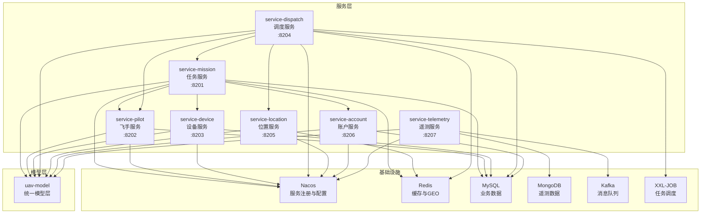

# UAV无人机调度平台微服务架构设计方案

## 📋 文档信息

- **项目名称**: UAV无人机调度平台
- **文档版本**: v1.0
- **创建日期**: 2026-02-23
- **设计目标**: 将单体uav-service模块重构为微服务架构

---

## 📊 一、现状分析

### 1.1 当前架构问题

#### 核心问题
```
uav-dispatch-platform/
├── uav-common/          ✅ 公共工具类（保持）
├── uav-api/             ✅ Dubbo API接口（保持）
├── uav-gateway-iot/     ✅ IoT网关服务（保持）
└── uav-service/         ❌ 单体服务（问题所在）
    ├── controller/      ❌ 所有Controller混在一起
    ├── service/         ❌ 所有Service混在一起
    ├── mapper/          ❌ 所有Mapper混在一起
    ├── domain/          ❌ 所有实体混在一起
    ├── dispatch/        ✅ 调度相关（已有子包结构）
    ├── location/        ✅ 位置相关（已有子包结构）
    ├── pilot/           ✅ 飞手相关（已有子包结构）
    └── telemetry/       ✅ 遥测相关
```

#### 识别的实体类（16个）
**任务相关（6个）**:
- `UavMission` - 无人机任务
- `MissionBill` - 任务账单
- `MissionComment` - 任务评价
- `MissionMonitor` - 任务监控
- `MissionStatusLog` - 任务状态日志
- `MissionJob` - XXL-JOB任务

**飞手相关（6个）**:
- `UavPilot` - 飞手信息
- `PilotAccount` - 飞手账户
- `PilotAccountDetail` - 账户明细
- `PilotLoginLog` - 登录日志
- `PilotSettings` - 飞手设置
- `PilotCertificationAudit` - 认证审核

**设备相关（1个）**:
- `UavDevice` - 无人机设备

**调度相关（1个）**:
- `XxlJobLog` - XXL-JOB日志

**遥测相关（1个）**:
- `UavTelemetryEntity` - 遥测数据

**枚举类（3个）**:
- `MissionStatus` - 任务状态
- `CancelReasonEnum` - 取消原因
- `OperatorTypeEnum` - 操作者类型
- `PilotCertificationStatus` - 认证状态

### 1.2 技术栈分析

**当前使用的技术**:
- ✅ Spring Boot 3.0.5
- ✅ Spring Cloud 2022.0.2
- ✅ Spring Cloud Alibaba 2022.0.0.0-RC2
- ✅ MyBatis-Plus 3.5.3.1
- ✅ MySQL 8.0.30
- ✅ Redis + Redisson 3.23.3
- ✅ Kafka 3.0.5
- ✅ MongoDB
- ✅ Dubbo 3.2.0
- ✅ Nacos 2.1.2
- ✅ XXL-JOB 2.4.1
- ✅ Sentinel
- ✅ 腾讯云COS

---

## 🎯 二、目标架构设计

### 2.1 整体架构图

```
uav-dispatch-platform/
├── uav-common/                    # 公共工具模块（保持）
├── uav-model/                     # 🆕 统一模型层
│   └── src/main/java/com/uav/model/
│       ├── entity/                # 实体类（按业务分包）
│       │   ├── base/
│       │   │   └── BaseEntity.java
│       │   ├── mission/           # 任务实体
│       │   │   ├── UavMission.java
│       │   │   ├── MissionBill.java
│       │   │   ├── MissionComment.java
│       │   │   ├── MissionMonitor.java
│       │   │   ├── MissionStatusLog.java
│       │   │   └── MissionJob.java
│       │   ├── pilot/             # 飞手实体
│       │   │   ├── UavPilot.java
│       │   │   ├── PilotAccount.java
│       │   │   ├── PilotAccountDetail.java
│       │   │   ├── PilotLoginLog.java
│       │   │   ├── PilotSettings.java
│       │   │   └── PilotCertificationAudit.java
│       │   ├── device/            # 设备实体
│       │   │   └── UavDevice.java
│       │   ├── dispatch/          # 调度实体
│       │   │   └── XxlJobLog.java
│       │   └── telemetry/         # 遥测实体
│       │       └── UavTelemetryEntity.java
│       ├── form/                  # 表单对象
│       │   ├── mission/
│       │   ├── pilot/
│       │   ├── dispatch/
│       │   └── location/
│       ├── vo/                    # 视图对象
│       │   ├── mission/
│       │   ├── pilot/
│       │   ├── dispatch/
│       │   ├── location/
│       │   └── device/
│       └── enums/                 # 枚举类
│           ├── MissionStatus.java
│           ├── CancelReasonEnum.java
│           ├── OperatorTypeEnum.java
│           └── PilotCertificationStatus.java
│
├── service/                       # 🆕 微服务层
│   ├── pom.xml                    # 服务父POM
│   ├── service-mission/           # 任务服务
│   ├── service-pilot/             # 飞手服务
│   ├── service-device/            # 设备服务
│   ├── service-dispatch/          # 调度服务
│   ├── service-location/          # 位置服务
│   ├── service-account/           # 账户服务
│   └── service-telemetry/         # 遥测服务
│
├── service-client/                # 🆕 服务调用接口层
│   ├── pom.xml                    # 客户端父POM
│   ├── service-mission-client/
│   ├── service-pilot-client/
│   ├── service-device-client/
│   ├── service-dispatch-client/
│   ├── service-location-client/
│   └── service-account-client/
│
├── uav-api/                       # Dubbo API（保持）
├── uav-gateway-iot/               # IoT网关（保持）
└── server-gateway/                # 🆕 API网关服务（可选）
```

### 2.2 服务端口规划

| 服务名称 | 端口 | 说明 |
|---------|------|------|
| service-mission | 8201 | 任务服务 |
| service-pilot | 8202 | 飞手服务 |
| service-device | 8203 | 设备服务 |
| service-dispatch | 8204 | 调度服务 |
| service-location | 8205 | 位置服务 |
| service-account | 8206 | 账户服务 |
| service-telemetry | 8207 | 遥测服务 |
| uav-gateway-iot | 8080 | IoT网关（现有）|
| server-gateway | 8888 | API网关（可选）|

---

## 🏗️ 三、详细模块设计

### 3.1 uav-model（统一模型层）

#### 职责
管理所有数据模型，包括实体类、VO、Form、枚举等，作为各服务的公共依赖。

#### 目录结构
```
uav-model/
├── pom.xml
└── src/main/java/com/uav/model/
    ├── entity/
    │   ├── base/
    │   │   └── BaseEntity.java              # 基础实体类
    │   ├── mission/                         # 任务领域实体
    │   │   ├── UavMission.java
    │   │   ├── MissionBill.java
    │   │   ├── MissionComment.java
    │   │   ├── MissionMonitor.java
    │   │   ├── MissionStatusLog.java
    │   │   └── MissionJob.java
    │   ├── pilot/                           # 飞手领域实体
    │   │   ├── UavPilot.java
    │   │   ├── PilotAccount.java
    │   │   ├── PilotAccountDetail.java
    │   │   ├── PilotLoginLog.java
    │   │   ├── PilotSettings.java
    │   │   └── PilotCertificationAudit.java
    │   ├── device/                          # 设备领域实体
    │   │   └── UavDevice.java
    │   ├── dispatch/                        # 调度领域实体
    │   │   └── XxlJobLog.java
    │   └── telemetry/                       # 遥测领域实体
    │       └── UavTelemetryEntity.java
    ├── form/                                # 表单对象
    │   ├── mission/
    │   ├── pilot/
    │   │   └── UpdatePilotAuthInfoForm.java
    │   ├── dispatch/
    │   │   └── StartDispatchForm.java
    │   └── location/
    │       └── UpdateLocationForm.java
    ├── vo/                                  # 视图对象
    │   ├── mission/
    │   ├── pilot/
    │   │   ├── PilotInfoVo.java
    │   │   └── PilotAuthInfoVo.java
    │   ├── dispatch/
    │   │   ├── DispatchRecordVo.java
    │   │   └── DispatchStatisticsVo.java
    │   ├── location/
    │   │   ├── PilotLocationVo.java
    │   │   └── NearbyPilotVo.java
    │   └── device/
    │       └── UavStatusVO.java
    └── enums/                               # 枚举类
        ├── MissionStatus.java
        ├── CancelReasonEnum.java
        ├── OperatorTypeEnum.java
        └── PilotCertificationStatus.java
```

#### 依赖关系
```xml
<dependencies>
    <!-- MyBatis-Plus注解支持 -->
    <dependency>
        <groupId>com.baomidou</groupId>
        <artifactId>mybatis-plus-annotation</artifactId>
    </dependency>
    
    <!-- Lombok -->
    <dependency>
        <groupId>org.projectlombok</groupId>
        <artifactId>lombok</artifactId>
    </dependency>
    
    <!-- Jackson注解 -->
    <dependency>
        <groupId>com.fasterxml.jackson.core</groupId>
        <artifactId>jackson-annotations</artifactId>
    </dependency>
</dependencies>
```

---

### 3.2 service-mission（任务服务）

#### 职责
管理无人机任务的完整生命周期。

#### 核心功能
- ✅ 任务发布
- ✅ 任务接单（含分布式锁）
- ✅ 任务执行
- ✅ 任务完成
- ✅ 任务取消
- ✅ 任务查询
- ✅ 任务账单管理
- ✅ 任务评价管理
- ✅ 任务监控

#### 目录结构
```
service-mission/
├── pom.xml
└── src/main/
    ├── java/com/uav/mission/
    │   ├── ServiceMissionApplication.java
    │   ├── controller/
    │   │   ├── MissionController.java
    │   │   ├── MissionBillController.java
    │   │   └── MissionCommentController.java
    │   ├── service/
    │   │   ├── UavMissionService.java
    │   │   ├── MissionBillService.java
    │   │   ├── MissionCommentService.java
    │   │   ├── MissionMonitorService.java
    │   │   └── MissionStatusLogService.java
    │   ├── service/impl/
    │   │   ├── UavMissionServiceImpl.java
    │   │   ├── MissionBillServiceImpl.java
    │   │   └── ...
    │   ├── mapper/
    │   │   ├── UavMissionMapper.java
    │   │   ├── MissionBillMapper.java
    │   │   └── ...
    │   └── config/
    │       ├── RedissonConfig.java
    │       └── MyBatisPlusConfig.java
    └── resources/
        ├── mapper/
        │   ├── UavMissionMapper.xml
        │   └── ...
        ├── application.yml
        └── bootstrap.yml
```

#### 数据库
- **数据库名**: `uav_mission`
- **表**: `uav_mission`, `mission_bill`, `mission_comment`, `mission_monitor`, `mission_status_log`

#### 服务依赖
```
service-mission 依赖:
  → service-pilot-client (查询飞手信息)
  → service-device-client (查询设备信息)
  → service-account-client (账户结算)
```

---

### 3.3 service-pilot（飞手服务）

#### 职责
管理飞手信息、认证、账户。

#### 核心功能
- ✅ 飞手注册
- ✅ 飞手认证审核
- ✅ 飞手信息管理
- ✅ 飞手登录日志
- ✅ 飞手设置

#### 目录结构
```
service-pilot/
├── pom.xml
└── src/main/
    ├── java/com/uav/pilot/
    │   ├── ServicePilotApplication.java
    │   ├── controller/
    │   │   └── PilotInfoController.java
    │   ├── service/
    │   │   ├── UavPilotService.java
    │   │   ├── PilotInfoService.java
    │   │   ├── PilotLoginLogService.java
    │   │   └── PilotSettingsService.java
    │   ├── service/impl/
    │   │   └── ...
    │   ├── mapper/
    │   │   └── ...
    │   └── config/
    └── resources/
        ├── mapper/
        ├── application.yml
        └── bootstrap.yml
```

#### 数据库
- **数据库名**: `uav_pilot`
- **表**: `uav_pilot`, `pilot_login_log`, `pilot_settings`, `pilot_certification_audit`

---

### 3.4 service-device（设备服务）

#### 职责
管理无人机设备信息。

#### 核心功能
- ✅ 设备注册
- ✅ 设备状态管理
- ✅ 设备查询
- ✅ 设备控制

#### 目录结构
```
service-device/
├── pom.xml
└── src/main/
    ├── java/com/uav/device/
    │   ├── ServiceDeviceApplication.java
    │   ├── controller/
    │   │   ├── DeviceController.java
    │   │   ├── DeviceControlController.java
    │   │   └── DeviceQueryController.java
    │   ├── service/
    │   │   ├── UavDeviceService.java
    │   │   └── UavQueryService.java
    │   ├── service/impl/
    │   │   └── ...
    │   └── mapper/
    └── resources/
```

#### 数据库
- **数据库名**: `uav_device`
- **表**: `uav_device`

---

### 3.5 service-dispatch（调度服务）

#### 职责
任务调度和分配。

#### 核心功能
- ✅ 任务调度
- ✅ 飞手匹配
- ✅ XXL-JOB任务管理
- ✅ 调度统计

#### 目录结构
```
service-dispatch/
├── pom.xml
└── src/main/
    ├── java/com/uav/dispatch/
    │   ├── ServiceDispatchApplication.java
    │   ├── controller/
    │   │   └── DispatchController.java
    │   ├── service/
    │   │   └── DispatchService.java
    │   ├── service/impl/
    │   │   └── DispatchServiceImpl.java
    │   ├── mapper/
    │   │   ├── MissionJobMapper.java
    │   │   └── XxlJobLogMapper.java
    │   ├── job/
    │   │   └── MissionDispatchJobHandler.java
    │   └── config/
    │       └── xxl/
    │           ├── XxlJobConfig.java
    │           ├── XxlJobClient.java
    │           └── XxlJobClientConfig.java
    └── resources/
```

#### 数据库
- **数据库名**: `uav_dispatch`
- **表**: `mission_job`, `xxl_job_log`

#### 服务依赖
```
service-dispatch 依赖:
  → service-mission-client (任务操作)
  → service-location-client (查询附近飞手)
  → service-pilot-client (飞手信息)
```

---

### 3.6 service-location（位置服务）

#### 职责
管理飞手位置信息。

#### 核心功能
- ✅ 位置更新（Redis GEO）
- ✅ 附近飞手查询
- ✅ 位置历史记录

#### 目录结构
```
service-location/
├── pom.xml
└── src/main/
    ├── java/com/uav/location/
    │   ├── ServiceLocationApplication.java
    │   ├── controller/
    │   │   └── LocationController.java
    │   ├── service/
    │   │   └── PilotLocationService.java
    │   ├── service/impl/
    │   │   └── PilotLocationServiceImpl.java
    │   └── config/
    │       └── RedisConfig.java
    └── resources/
```

#### 数据存储
- **Redis GEO**: 实时位置数据
- **无需独立数据库**

---

### 3.7 service-account（账户服务）

#### 职责
管理飞手账户和交易。

#### 核心功能
- ✅ 账户余额管理
- ✅ 交易记录
- ✅ 提现管理

#### 目录结构
```
service-account/
├── pom.xml
└── src/main/
    ├── java/com/uav/account/
    │   ├── ServiceAccountApplication.java
    │   ├── controller/
    │   │   └── AccountController.java
    │   ├── service/
    │   │   ├── PilotAccountService.java
    │   │   └── PilotAccountDetailService.java
    │   ├── service/impl/
    │   │   └── ...
    │   └── mapper/
    └── resources/
```

#### 数据库
- **数据库名**: `uav_account`
- **表**: `pilot_account`, `pilot_account_detail`

---

### 3.8 service-telemetry（遥测服务）

#### 职责
处理无人机遥测数据。

#### 核心功能
- ✅ 遥测数据接收（Kafka消费）
- ✅ 遥测数据存储（MongoDB）
- ✅ 遥测数据查询

#### 目录结构
```
service-telemetry/
├── pom.xml
└── src/main/
    ├── java/com/uav/telemetry/
    │   ├── ServiceTelemetryApplication.java
    │   ├── consumer/
    │   │   └── UavTelemetryConsumer.java
    │   ├── repository/
    │   │   └── UavTelemetryRepository.java
    │   └── config/
    │       ├── KafkaConfig.java
    │       └── MongoConfig.java
    └── resources/
```

#### 数据存储
- **MongoDB**: 遥测数据（时序数据）
- **Collection**: `uav_telemetry`

---

### 3.9 service-client（服务调用接口层）

#### 职责
定义服务间调用的Feign接口。

#### 示例：service-mission-client

```
service-mission-client/
├── pom.xml
└── src/main/java/com/uav/mission/client/
    ├── MissionFeignClient.java
    ├── MissionBillFeignClient.java
    └── fallback/
        ├── MissionFeignClientFallback.java
        └── MissionBillFeignClientFallback.java
```

#### Feign接口示例

```java
@FeignClient(
    name = "service-mission",
    fallback = MissionFeignClientFallback.class
)
public interface MissionFeignClient {
    
    @GetMapping("/api/mission/{missionId}")
    Result<UavMission> getMissionById(@PathVariable("missionId") Long missionId);
    
    @PostMapping("/api/mission/publish")
    Result<UavMission> publishMission(@RequestBody PublishMissionForm form);
    
    @PostMapping("/api/mission/accept")
    Result<String> acceptMission(@RequestBody AcceptMissionForm form);
}
```

#### 所有Client模块
- `service-mission-client`
- `service-pilot-client`
- `service-device-client`
- `service-dispatch-client`
- `service-location-client`
- `service-account-client`

---

## 🔄 四、服务依赖关系图



---

## 📝 五、实施计划

### 5.1 阶段划分

#### 阶段一：基础架构搭建（第1-2周）

**目标**: 创建基础模块结构

**任务清单**:
- [x] 创建`uav-model`模块
  - [x] 创建目录结构
  - [x] 配置pom.xml
  - [x] 迁移所有实体类到`entity/`
  - [x] 迁移所有VO到`vo/`
  - [x] 迁移所有Form到`form/`
  - [x] 迁移所有枚举到`enums/`
  
- [x] 创建`service`父模块
  - [x] 创建service/pom.xml
  - [x] 配置公共依赖
  
- [x] 创建`service-client`父模块
  - [x] 创建service-client/pom.xml
  - [x] 配置公共依赖

- [x] 更新根pom.xml
  - [x] 添加新模块到`<modules>`
  - [x] 配置依赖管理

**验收标准**:
- ✅ 所有模块可以正常编译
- ✅ 依赖关系正确
- ✅ 旧的uav-service仍可运行

---

#### 阶段二：拆分已有良好结构的服务（第3-4周）

**优先级**: 高（这些模块已有良好的子包结构）

##### 2.1 拆分service-dispatch（第3周）

**任务清单**:
- [ ] 创建service-dispatch模块
- [ ] 迁移dispatch包下所有代码
  - [ ] controller/DispatchController.java
  - [ ] service/DispatchService.java
  - [ ] service/impl/DispatchServiceImpl.java
  - [ ] job/MissionDispatchJobHandler.java
  - [ ] config/xxl/*
- [ ] 迁移相关Mapper
  - [ ] MissionJobMapper.java
  - [ ] XxlJobLogMapper.java
- [ ] 迁移Mapper XML文件
- [ ] 配置application.yml
- [ ] 配置bootstrap.yml
- [ ] 创建启动类
- [ ] 单元测试

**验收标准**:
- ✅ 服务可独立启动
- ✅ XXL-JOB任务正常执行
- ✅ 调度功能正常

##### 2.2 拆分service-location（第3周）

**任务清单**:
- [ ] 创建service-location模块
- [ ] 迁移location包下所有代码
  - [ ] controller/LocationController.java
  - [ ] service/PilotLocationService.java
  - [ ] service/impl/PilotLocationServiceImpl.java
- [ ] 配置Redis连接
- [ ] 配置application.yml
- [ ] 创建启动类
- [ ] 单元测试

**验收标准**:
- ✅ 服务可独立启动
- ✅ 位置更新功能正常
- ✅ 附近飞手查询正常

##### 2.3 拆分service-pilot（第4周）

**任务清单**:
- [ ] 创建service-pilot模块
- [ ] 迁移pilot包下所有代码
  - [ ] controller/PilotInfoController.java
  - [ ] service/PilotInfoService.java
  - [ ] service/impl/PilotInfoServiceImpl.java
- [ ] 迁移飞手相关Service
  - [ ] UavPilotService
  - [ ] PilotLoginLogService
  - [ ] PilotSettingsService
- [ ] 迁移相关Mapper
- [ ] 配置数据库连接
- [ ] 创建启动类
- [ ] 单元测试

**验收标准**:
- ✅ 服务可独立启动
- ✅ 飞手信息管理正常
- ✅ 认证审核功能正常

---

#### 阶段三：拆分核心业务服务（第5-7周）

##### 3.1 拆分service-mission（第5-6周）

**任务清单**:
- [ ] 创建service-mission模块
- [ ] 迁移任务相关Controller
  - [ ] UavMissionController → MissionController
- [ ] 迁移任务相关Service
  - [ ] UavMissionService
  - [ ] MissionBillService
  - [ ] MissionCommentService
  - [ ] MissionMonitorService
  - [ ] MissionStatusLogService
- [ ] 迁移相关Mapper和XML
- [ ] 配置Redisson分布式锁
- [ ] 配置数据库连接
- [ ] 创建启动类
- [ ] 单元测试
- [ ] 集成测试

**验收标准**:
- ✅ 服务可独立启动
- ✅ 任务发布功能正常
- ✅ 任务接单（分布式锁）正常
- ✅ 任务完整生命周期正常

##### 3.2 拆分service-device（第6周）

**任务清单**:
- [ ] 创建service-device模块
- [ ] 迁移设备相关Controller
  - [ ] UavDeviceController → DeviceController
  - [ ] UavControlController → DeviceControlController
  - [ ] UavQueryController → DeviceQueryController
- [ ] 迁移设备相关Service
  - [ ] UavDeviceService
  - [ ] UavQueryService
- [ ] 迁移相关Mapper
- [ ] 配置数据库连接
- [ ] 创建启动类
- [ ] 单元测试

**验收标准**:
- ✅ 服务可独立启动
- ✅ 设备管理功能正常
- ✅ 设备查询功能正常

##### 3.3 拆分service-account（第7周）

**任务清单**:
- [ ] 创建service-account模块
- [ ] 迁移账户相关Service
  - [ ] PilotAccountService
  - [ ] PilotAccountDetailService
- [ ] 创建AccountController
- [ ] 迁移相关Mapper
- [ ] 配置数据库连接
- [ ] 创建启动类
- [ ] 单元测试

**验收标准**:
- ✅ 服务可独立启动
- ✅ 账户管理功能正常
- ✅ 交易记录功能正常

##### 3.4 拆分service-telemetry（第7周）

**任务清单**:
- [ ] 创建service-telemetry模块
- [ ] 迁移遥测相关代码
  - [ ] UavTelemetryConsumer
  - [ ] UavTelemetryRepository
- [ ] 配置Kafka连接
- [ ] 配置MongoDB连接
- [ ] 创建启动类
- [ ] 单元测试

**验收标准**:
- ✅ 服务可独立启动
- ✅ Kafka消费正常
- ✅ MongoDB存储正常

---

#### 阶段四：创建服务调用接口（第8-9周）

**任务清单**:
- [ ] 创建service-mission-client
  - [ ] MissionFeignClient
  - [ ] MissionBillFeignClient
  - [ ] Fallback实现
  
- [ ] 创建service-pilot-client
  - [ ] PilotFeignClient
  - [ ] Fallback实现
  
- [ ] 创建service-device-client
  - [ ] DeviceFeignClient
  - [ ] Fallback实现
  
- [ ] 创建service-dispatch-client
  - [ ] DispatchFeignClient
  - [ ] Fallback实现
  
- [ ] 创建service-location-client
  - [ ] LocationFeignClient
  - [ ] Fallback实现
  
- [ ] 创建service-account-client
  - [ ] AccountFeignClient
  - [ ] Fallback实现

**验收标准**:
- ✅ 所有Client模块可编译
- ✅ Feign接口定义完整
- ✅ Fallback降级逻辑完善

---

#### 阶段五：服务间调用改造（第10-11周）

**任务清单**:
- [ ] service-mission改造
  - [ ] 引入service-pilot-client
  - [ ] 引入service-device-client
  - [ ] 引入service-account-client
  - [ ] 替换直接调用为Feign调用
  
- [ ] service-dispatch改造
  - [ ] 引入service-mission-client
  - [ ] 引入service-location-client
  - [ ] 引入service-pilot-client
  - [ ] 替换直接调用为Feign调用

**改造示例**:
```java
// 改造前
@Autowired
private UavPilotService pilotService;
UavPilot pilot = pilotService.getById(pilotId);

// 改造后
@Autowired
private PilotFeignClient pilotFeignClient;
Result<UavPilot> result = pilotFeignClient.getPilotById(pilotId);
UavPilot pilot = result.getData();
```

**验收标准**:
- ✅ 所有服务间调用改为Feign
- ✅ 降级逻辑正常工作
- ✅ 链路追踪正常

---

#### 阶段六：测试与优化（第12周）

**任务清单**:
- [ ] 单元测试
  - [ ] 每个服务的单元测试覆盖率>80%
  
- [ ] 集成测试
  - [ ] 任务完整流程测试
  - [ ] 调度流程测试
  - [ ] 账户结算流程测试
  
- [ ] 性能测试
  - [ ] 压力测试
  - [ ] 并发测试
  - [ ] 响应时间测试
  
- [ ] 配置优化
  - [ ] Nacos配置中心
  - [ ] Sentinel流控规则
  - [ ] 数据库连接池优化
  
- [ ] 文档完善
  - [ ] API文档（Swagger）
  - [ ] 部署文档
  - [ ] 运维文档

**验收标准**:
- ✅ 所有测试通过
- ✅ 性能达标
- ✅ 文档完整

---

#### 阶段七：灰度发布与下线旧服务（第13-14周）

**任务清单**:
- [ ] 灰度发布
  - [ ] 10%流量切换到新服务
  - [ ] 观察监控指标
  - [ ] 50%流量切换
  - [ ] 100%流量切换
  
- [ ] 下线旧服务
  - [ ] 停止uav-service
  - [ ] 清理旧代码
  - [ ] 更新部署脚本

**验收标准**:
- ✅ 新服务稳定运行
- ✅ 旧服务完全下线
- ✅ 无业务影响

---

## 📋 六、关键配置示例

### 6.1 父POM配置

```xml
<!-- pom.xml -->
<modules>
    <module>uav-common</module>
    <module>uav-model</module>          <!-- 新增 -->
    <module>uav-api</module>
    <module>uav-gateway-iot</module>
    <module>service</module>            <!-- 新增 -->
    <module>service-client</module>     <!-- 新增 -->
    <module>uav-service</module>        <!-- 保留，待下线 -->
</modules>

<dependencyManagement>
    <dependencies>
        <!-- 内部模块 -->
        <dependency>
            <groupId>com.uav.dispatch</groupId>
            <artifactId>uav-model</artifactId>
            <version>${project.version}</version>
        </dependency>
        <!-- ... 其他依赖 ... -->
    </dependencies>
</dependencyManagement>
```

### 6.2 uav-model的pom.xml

```xml
<?xml version="1.0" encoding="UTF-8"?>
<project xmlns="http://maven.apache.org/POM/4.0.0">
    <modelVersion>4.0.0</modelVersion>
    <parent>
        <groupId>com.uav.dispatch</groupId>
        <artifactId>uav-dispatch-platform</artifactId>
        <version>1.0.0-SNAPSHOT</version>
    </parent>

    <artifactId>uav-model</artifactId>
    <name>uav-model</name>
    <description>UAV统一模型层</description>

    <dependencies>
        <!-- MyBatis-Plus注解支持 -->
        <dependency>
            <groupId>com.baomidou</groupId>
            <artifactId>mybatis-plus-annotation</artifactId>
        </dependency>
        
        <!-- Lombok -->
        <dependency>
            <groupId>org.projectlombok</groupId>
            <artifactId>lombok</artifactId>
            <optional>true</optional>
        </dependency>
        
        <!-- Jackson注解 -->
        <dependency>
            <groupId>com.fasterxml.jackson.core</groupId>
            <artifactId>jackson-annotations</artifactId>
        </dependency>
        
        <!-- Spring Data MongoDB注解（用于UavTelemetryEntity） -->
        <dependency>
            <groupId>org.springframework.boot</groupId>
            <artifactId>spring-boot-starter-data-mongodb</artifactId>
            <scope>provided</scope>
        </dependency>
    </dependencies>
</project>
```

### 6.3 service父POM配置

```xml
<?xml version="1.0" encoding="UTF-8"?>
<project xmlns="http://maven.apache.org/POM/4.0.0">
    <modelVersion>4.0.0</modelVersion>
    <parent>
        <groupId>com.uav.dispatch</groupId>
        <artifactId>uav-dispatch-platform</artifactId>
        <version>1.0.0-SNAPSHOT</version>
    </parent>

    <artifactId>service</artifactId>
    <packaging>pom</packaging>
    <name>service</name>
    <description>微服务父模块</description>

    <modules>
        <module>service-mission</module>
        <module>service-pilot</module>
        <module>service-device</module>
        <module>service-dispatch</module>
        <module>service-location</module>
        <module>service-account</module>
        <module>service-telemetry</module>
    </modules>

    <dependencies>
        <!-- 模型层 -->
        <dependency>
            <groupId>com.uav.dispatch</groupId>
            <artifactId>uav-model</artifactId>
        </dependency>
        
        <!-- 公共模块 -->
        <dependency>
            <groupId>com.uav.dispatch</groupId>
            <artifactId>uav-common</artifactId>
        </dependency>
        
        <!-- Spring Boot Web -->
        <dependency>
            <groupId>org.springframework.boot</groupId>
            <artifactId>spring-boot-starter-web</artifactId>
        </dependency>
        
        <!-- Nacos Discovery -->
        <dependency>
            <groupId>com.alibaba.cloud</groupId>
            <artifactId>spring-cloud-starter-alibaba-nacos-discovery</artifactId>
        </dependency>
        
        <!-- Nacos Config -->
        <dependency>
            <groupId>com.alibaba.cloud</groupId>
            <artifactId>spring-cloud-starter-alibaba-nacos-config</artifactId>
        </dependency>
        
        <!-- OpenFeign -->
        <dependency>
            <groupId>org.springframework.cloud</groupId>
            <artifactId>spring-cloud-starter-openfeign</artifactId>
        </dependency>
        
        <!-- Sentinel -->
        <dependency>
            <groupId>com.alibaba.cloud</groupId>
            <artifactId>spring-cloud-starter-alibaba-sentinel</artifactId>
        </dependency>
        
        <!-- Lombok -->
        <dependency>
            <groupId>org.projectlombok</groupId>
            <artifactId>lombok</artifactId>
            <optional>true</optional>
        </dependency>
    </dependencies>
</project>
```

### 6.4 service-mission的application.yml

```yaml
server:
  port: 8201

spring:
  application:
    name: service-mission
  
  datasource:
    driver-class-name: com.mysql.cj.jdbc.Driver
    url: jdbc:mysql://localhost:3306/uav_mission?useUnicode=true&characterEncoding=utf-8&useSSL=false&serverTimezone=Asia/Shanghai
    username: root
    password: ${DB_PASSWORD:your_password}
  
  redis:
    host: ${REDIS_HOST:localhost}
    port: ${REDIS_PORT:6379}
    database: 0
  
  cloud:
    nacos:
      discovery:
        server-addr: ${NACOS_ADDR:101.42.103.115:8848}
        namespace: ${NACOS_NAMESPACE:dev}
      config:
        server-addr: ${NACOS_ADDR:101.42.103.115:8848}
        namespace: ${NACOS_NAMESPACE:dev}
        file-extension: yml

mybatis-plus:
  mapper-locations: classpath:mapper/*.xml
  type-aliases-package: com.uav.model.entity.mission
  configuration:
    map-underscore-to-camel-case: true
    log-impl: org.apache.ibatis.logging.stdout.StdOutImpl

# Feign配置
feign:
  sentinel:
    enabled: true
  client:
    config:
      default:
        connectTimeout: 5000
        readTimeout: 5000

# Redisson配置
redisson:
  address: redis://${REDIS_HOST:localhost}:${REDIS_PORT:6379}
  database: 0
```

### 6.5 Feign Client示例

```java
package com.uav.mission.client;

import com.uav.common.Result;
import com.uav.model.entity.mission.UavMission;
import com.uav.model.form.mission.PublishMissionForm;
import com.uav.model.form.mission.AcceptMissionForm;
import com.uav.mission.client.fallback.MissionFeignClientFallback;
import org.springframework.cloud.openfeign.FeignClient;
import org.springframework.web.bind.annotation.*;

import java.math.BigDecimal;

/**
 * 任务服务Feign客户端
 */
@FeignClient(
    name = "service-mission",
    fallback = MissionFeignClientFallback.class
)
public interface MissionFeignClient {
    
    /**
     * 根据ID查询任务
     */
    @GetMapping("/api/mission/{missionId}")
    Result<UavMission> getMissionById(@PathVariable("missionId") Long missionId);
    
    /**
     * 发布任务
     */
    @PostMapping("/api/mission/publish")
    Result<UavMission> publishMission(@RequestBody PublishMissionForm form);
    
    /**
     * 接受任务
     */
    @PostMapping("/api/mission/accept")
    Result<String> acceptMission(@RequestBody AcceptMissionForm form);
    
    /**
     * 开始任务
     */
    @PostMapping("/api/mission/start")
    Result<String> startMission(@RequestParam("missionId") Long missionId);
    
    /**
     * 完成任务
     */
    @PostMapping("/api/mission/complete")
    Result<String> completeMission(
        @RequestParam("missionId") Long missionId,
        @RequestParam("actualDistance") BigDecimal actualDistance
    );
    
    /**
     * 取消任务
     */
    @PostMapping("/api/mission/cancel")
    Result<String> cancelMission(
        @RequestParam("missionId") Long missionId,
        @RequestParam("cancelReason") Integer cancelReason
    );
}
```

### 6.6 Fallback降级实现

```java
package com.uav.mission.client.fallback;

import com.uav.common.Result;
import com.uav.common.ResultCodeEnum;
import com.uav.model.entity.mission.UavMission;
import com.uav.model.form.mission.PublishMissionForm;
import com.uav.model.form.mission.AcceptMissionForm;
import com.uav.mission.client.MissionFeignClient;
import lombok.extern.slf4j.Slf4j;
import org.springframework.stereotype.Component;

import java.math.BigDecimal;

/**
 * 任务服务降级处理
 */
@Slf4j
@Component
public class MissionFeignClientFallback implements MissionFeignClient {
    
    @Override
    public Result<UavMission> getMissionById(Long missionId) {
        log.error("调用任务服务失败，触发降级: getMissionById, missionId={}", missionId);
        return Result.build(null, ResultCodeEnum.SERVICE_ERROR);
    }
    
    @Override
    public Result<UavMission> publishMission(PublishMissionForm form) {
        log.error("调用任务服务失败，触发降级: publishMission");
        return Result.build(null, ResultCodeEnum.SERVICE_ERROR);
    }
    
    @Override
    public Result<String> acceptMission(AcceptMissionForm form) {
        log.error("调用任务服务失败，触发降级: acceptMission");
        return Result.build(null, ResultCodeEnum.SERVICE_ERROR);
    }
    
    @Override
    public Result<String> startMission(Long missionId) {
        log.error("调用任务服务失败，触发降级: startMission, missionId={}", missionId);
        return Result.build(null, ResultCodeEnum.SERVICE_ERROR);
    }
    
    @Override
    public Result<String> completeMission(Long missionId, BigDecimal actualDistance) {
        log.error("调用任务服务失败，触发降级: completeMission, missionId={}", missionId);
        return Result.build(null, ResultCodeEnum.SERVICE_ERROR);
    }
    
    @Override
    public Result<String> cancelMission(Long missionId, Integer cancelReason) {
        log.error("调用任务服务失败，触发降级: cancelMission, missionId={}", missionId);
        return Result.build(null, ResultCodeEnum.SERVICE_ERROR);
    }
}
```

---

## ⚠️ 七、注意事项与风险控制

### 7.1 数据库拆分

**原则**:
- ✅ 每个服务使用独立的数据库schema
- ✅ 避免跨库join，通过服务调用获取关联数据
- ✅ 保持数据一致性

**数据库规划**:
```
uav_mission    - 任务服务数据库
uav_pilot      - 飞手服务数据库
uav_device     - 设备服务数据库
uav_dispatch   - 调度服务数据库
uav_account    - 账户服务数据库
```

### 7.2 事务处理

**单服务内事务**:
```java
@Transactional(rollbackFor = Exception.class)
public void createMission(PublishMissionForm form) {
    // 单服务内使用@Transactional
}
```

**跨服务事务**:
- 优先使用最终一致性方案
- 必要时使用Seata分布式事务
- 使用消息队列实现异步补偿

### 7.3 配置管理

**Nacos配置中心**:
```
命名空间:
  - dev    (开发环境)
  - test   (测试环境)
  - prod   (生产环境)

配置文件:
  - service-mission.yml
  - service-pilot.yml
  - ...
  - common.yml (公共配置)
```

### 7.4 服务治理

**Sentinel流控规则**:
```java
// 限流规则
FlowRule rule = new FlowRule();
rule.setResource("getMissionById");
rule.setGrade(RuleConstant.FLOW_GRADE_QPS);
rule.setCount(100); // QPS限制
```

**熔断降级**:
```java
// 熔断规则
DegradeRule rule = new DegradeRule();
rule.setResource("service-mission");
rule.setGrade(RuleConstant.DEGRADE_GRADE_RT);
rule.setCount(1000); // 响应时间阈值
rule.setTimeWindow(10); // 熔断时长
```

### 7.5 日志追踪

**SkyWalking配置**:
```yaml
# application.yml
skywalking:
  agent:
    service_name: ${spring.application.name}
    collector:
      backend_service: ${SKYWALKING_ADDR:localhost:11800}
```

**日志格式**:
```
[traceId] [spanId] [serviceName] [timestamp] [level] [message]
```

### 7.6 版本兼容

**API版本管理**:
```java
@RestController
@RequestMapping("/api/v1/mission")
public class MissionController {
    // v1版本API
}

@RestController
@RequestMapping("/api/v2/mission")
public class MissionControllerV2 {
    // v2版本API
}
```

### 7.7 灰度发布策略

**流量切换计划**:
```
第1天: 10%流量  → 观察24小时
第3天: 30%流量  → 观察24小时
第5天: 50%流量  → 观察24小时
第7天: 100%流量 → 观察48小时
第9天: 下线旧服务
```

---

## 📈 八、预期收益

### 8.1 架构层面
- ✅ 清晰的服务边界和职责划分
- ✅ 独立部署和扩展能力
- ✅ 降低服务间耦合度
- ✅ 提高系统可维护性

### 8.2 开发层面
- ✅ 团队可并行开发不同服务
- ✅ 代码结构清晰，易于理解
- ✅ 减少代码冲突
- ✅ 提高开发效率

### 8.3 运维层面
- ✅ 服务可独立部署和回滚
- ✅ 故障隔离，不影响其他服务
- ✅ 可针对性能瓶颈服务扩容
- ✅ 便于监控和问题定位

### 8.4 业务层面
- ✅ 快速响应业务需求变化
- ✅ 支持灰度发布和A/B测试
- ✅ 提高系统稳定性和可用性

---

## 📚 九、参考资料

1. **代驾项目架构**
   - 路径: `D:\代驾项目\0211.尚硅谷Java项目-乐尚代驾\代码\daijia-parent`
   - 重点参考: 模块划分、service-client设计、model层组织

2. **Spring Cloud Alibaba官方文档**
   - Nacos服务注册与配置
   - Sentinel流量控制
   - Seata分布式事务

3. **MyBatis-Plus官方文档**
   - 代码生成器使用
   - 乐观锁配置

4. **Redisson官方文档**
   - 分布式锁使用

---

## 🚀 十、下一步行动

### 立即开始
1. **审阅本设计方案**
   - 确认架构设计是否符合预期
   - 确认服务拆分粒度是否合理
   - 确认实施计划是否可行

2. **准备开发环境**
   - 确保Nacos服务正常运行
   - 确保数据库环境就绪
   - 确保Redis、Kafka等中间件就绪

3. **开始实施**
   - 从阶段一开始：创建uav-model模块
   - 按照计划逐步推进
   - 每完成一个阶段进行验收

### 需要确认的问题
1. 是否需要调整服务拆分粒度？
2. 是否需要调整实施时间表？
3. 是否有其他特殊需求？

---

**重构是一个渐进的过程，不要急于求成。每完成一个服务的拆分，都是向目标架构迈进的一大步！**

**祝重构顺利！如有问题，随时沟通调整方案。**